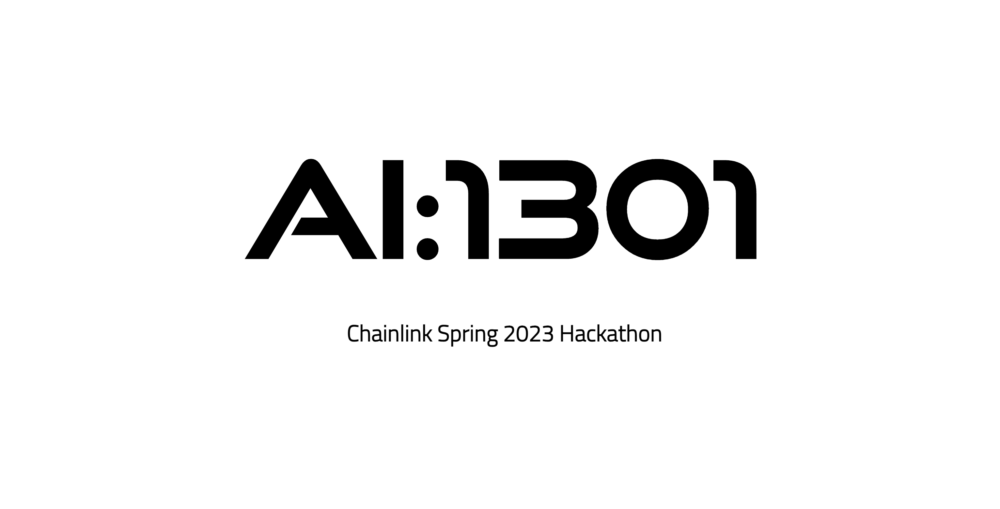

# Overview

This repository represents my submission for the [Chainlink Spring 2023 Hackathon](https://chain.link/hackathon).

Other useful links include: [Devpost project]() and [Youtube DEMO presentation]().

# Motivation

The project aims to:

- **Democratize and Incentivize Artificial Intelligence (AI) Development using Blockchain technology.**

AI was and contiues to be a strong fascination of many intelligent people. There is, however, an ever growing major problem in the field since all of the innovation is controlled by a small group of powerful companies.

The world needs to have an enormous number of dedicated, focused, and incentivized people which will contribute to the humanities well being. Otherwise, all of the civilization is headed towards tyranny and disastrous distopia.

In order to achieve this, **AI:1301** provides an economic incentive as well an open and fair playing field for everyone.

# Football

Most of current AI models are based on Machine / Deep Learning (ML/DL) architectures that require large scale datasets in order to effectively train them. Comming by such datasets is a rare opportunity since companies have no interest in openly sharing them, while the infrastructure for performing the training/validation/testing of models is also centralized.

To combat this, **AI:1301** creates a completely on-chain game of Football where AI models operate as the brains of opossing football teams. They position individuals player, and issue commands to pass the ball or take a shot.

Since, all of the blockchain data is open to public, anyone can gather all of the data from previous matches. This can be used for a thorough analysis of the game, as well as for the experimentation with and the creation of powerful new models.

# Inner Workings

To achive its aim, the following mechanisms are utilized:

- [**Chainlink Functions**](https://chain.link/functions)
  - enables communication with the AI models
- [**Chainlink Verifiable Random Function (VRFv2)**](https://docs.chain.link/vrf/v2/introduction)
  - source of randomness used to determine the next state transition
- [**Space and Time (SxT)**](https://www.spaceandtime.io/)
  - to monitor the state of a match, and perform the state update
- [**Polygon (Mumbai) Ethereum Virtual Machine (EVM) blockchain**](https://mumbai.polygonscan.com/)
  - supports all of the above

## Detailed Flow

### Infrastructure Deployment

- The initial step that both players need to take is the neccessary infrastructure deployment.

- This includes a set of a smart contracts and a server that will contain:

  - a Monitoring service (used to observe the progression of a match)
  - an AI model (used to make decisions)
  - API service (used for communication with the Chainlink Decentralized Oracle Network (DON))
    - It will be called the request has been initiated by the player's corresponding contracts

- There are always two contracts per player which act as Function Consumers that enable a commitment-reveal scheme needed to keep the game fair.

### Starting a match

- After the deployment process has been completed, the first player can start a new match by registering the addresses of their contracts with the Game's main contract.

### Joining a match

- The second player can then join the match by the same passing the same type of information, as well as the desired match ID.

- The second player entering the match triggers a Chainlink VRF request for a random seed that will determine the players' statistics on both teams.

### Advancer

- After the randomness has been fullfiled, the Advancer takes the responsability for the progression of a match.

- There are three main stages that a match can be in:

  - Commitment
    - simultaniously issues two requests for AI models to commit to their next move (processed by Chainlink DON)
  - Reveal
    - simultaniously issues two requests to reveal the underlying data (processed by Chainlink DON)
  - State Update
    - triggers a request to the Space and Time sevice which will report the next state of a match
      - based on the data provided by the game's server

- The match moves repeatedly through thesse stages until its end.

### Monitoring

- During a match, AI models observe the match's state using the Space and Time service.

### Disputer

- If the reported state is wrong in any way, anyone can trigger a dispute
  - This transaction will verify whether the sequence of states is correct since all of the game logic is contained on-chain
  - If there is a discreprency, the game is completely halted

# Demo

# Upcoming Upgrades

There is a series of upcoming upgrades to make this project even more interesting:

- **Multi-agent game modes**
  - Create Collaborative and Competitive environments (Not only two teams)
- **Parallel matches**
  - Bundle moves for multiple matches
- **Monte Carlo simulations**
  - Test AI models before real matches
- **DATA APIs**
  - Standardize all data (for analysis and model training)
- **Dynamically evolving NFTs**
  - Players whose performance statistics change over time
- **Tokenomics**
  - Enable Play-to-Earn (P2E) mechanism
- **AI infrastructure**
  - Cloud AI model training / deployment
- **Tournaments / Leagues**
  - Community evolution

# Deployed Contracts

# Getting Started

There are multiple Hardhat.js/Express.js/React.js projects instantiated in this repository.
Reason being that it was just easier to have a separation of concers and three different configurations. The repository is organized as such:

- `back`
  - `advancer` (Express.js project with embedded [Space and Time Javascript SDK](https://docs.spaceandtime.io/docs/javascript-sdk))
  - `ai-models`
    - contain the trained AI models, and the code to run inference
  - `api-server` (Express.js project)
    - contains a API server which will be contacted by Chainlink DON and will call `../ai-models`
  - `cli`
    - contains shell scripts (to ease navigating all of the internal projects)
  - `smart-contract`
    - `game` (a custom Hardhat.js project)
      - contains all of the on-chain logic for the game, as well as Function Consumer Mocks
    - `player` (adjusted [Chainlink Functions Starter Kit Template](https://github.com/smartcontractkit/functions-hardhat-starter-kit) - Hardhat.js project)
      - contains the Function Consumer contract that will be deployed by the player
        - this type of contract is used both for the Commitment and Reveal stage
    - `sxt` (adjusted [Space and Time -Dynamic NFTs Template](https://github.com/SxT-Community/SxT-dNFT) - Hardhat.js project)
      - its Function Consumer contract is responsible for updating the match state
- `front` (React.js project)
  - used to enable a visual depiction of matches (+ there's a presentation on one of the routes)

## Setup

Follow these sequence of steps to make a correct arrangement of all contracts' links.

1. **Chainlink Function Consumers:**

- `cd player && npx env-enc set-pw`
  - If its running the first time set up all the needed env-enc variables
- (repeat 2 times)
  - `export TEAM_ID=<1/2>`
  - `npx hardhat run scripts/deploy.js --network polygonMumbai`
    - copy the output's addresses
  - set its addresses (`P<1/2>_COMMITMENT_FUNCTION_CONSUMER_SC_ADRESS` and `P<1/2>_REVEAL_FUNCTION_CONSUMER_SC_ADRESS`) in the `../cli/.env`
  - repeat for both commitment and reveal:
    - `npx hardhat functions-sub-create --network polygonMumbai --amount 5 --contract <P<1/2>_<COMMITMENT/REVEAL>_FUNCTION_CONSUMER_SC_ADRESS>`
  - set the `P<1/2>_<COMMITMENT/REVEAL>_SUB_ID` variables in the .env file
  - `npx hardhat run scripts/update.js --network polygonMumbai`

2. **SxT Function Consumer:**

- `cd sxt && npx env-enc set-pw`

  - If its running the first time set up all the needed env-enc variables

- `npx hardhat run scripts/deploy.js --network mumbai`
  - copy the output's address
- set its address (`SXT_FUNCTION_CONSUMER_SC_ADRESS`) in the `../cli/.env`
- `npx hardhat functions-sub-create --network mumbai --amount 5 --contract <SXT_FUNCTION_CONSUMER_SC_ADRESS>`
- set the `SXT_SUB_ID` variable in the .env file
- check the `./scripts/update.js` for the correct `SRC` content
  - Notice: Access token is valid for only 30 minutes
- `npx hardhat run scripts/update.js --network mumbai`

3. **Game:**

- `cd game && npx env-enc set-pw`
  - If its running the first time set up all the needed env-enc variables
- `npx hardhat run scripts/deploy.js --network mumbai`
  - copy the output's address
- set its address (`GAME_SC_ADDRESS`) in the `../cli/.env`
- send 0.5 LINK to this contract (used for Chainlink's VRF)
- verify contract:
  - `export POLYGON_MUMBAI_RPC_URL="https://polygon-mumbai-bor.publicnode.com" && export POLYGONSCAN_API_KEY="26A2Y9ARFB38U8J6B5RVCASAG2JVCVVF87" && npx hardhat verify <GAME_SC_ADDRESS> --network mumbai`

## Other useful commands

- Financing an already existing subscription:
  - `npx hardhat functions-sub-fund --subid <SUB_ID> --amount <AMOUNT> --network polygonMumbai`

## Additional Information
